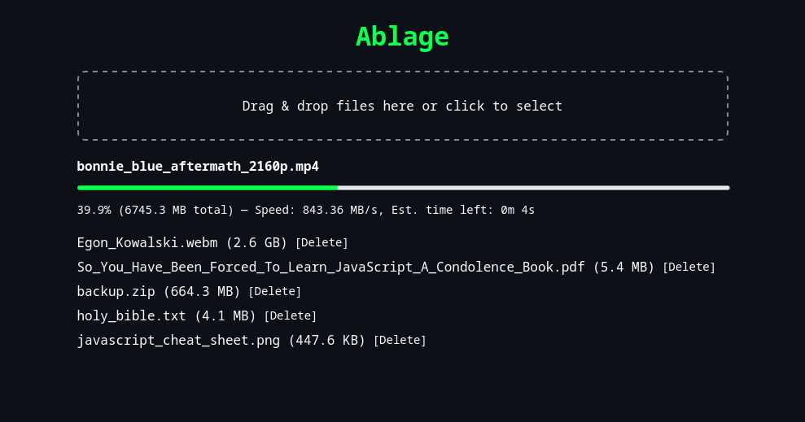

# ablage

**A secure, minimal file exchange web application with optional authentication and HTTPS support.**



## Features

- Drag & drop file upload with real time progress
- Download and delete uploaded files directly from the web interface
- Fully responsive web UI for desktop and mobile
- HTTPS support with self-signed or user-provided certificates
- Sinkhole mode to hide existing files
- Optional password protection
- HTTP mode for local, unencrypted usage
- No external dependencies on runtime
- No bullshit

## Installation

1. Clone the repository:

```bash
git clone https://git.0x0001f346.de/andreas/ablage.git
cd ablage
```

2. Build and run:

```bash
go build -o build/ . && build/ablage [flags]
```

## Usage & Flags

| Flag         | Description                                                                                 |
| ------------ | ------------------------------------------------------------------------------------------- |
| `--auth`     | Enable Basic Authentication.                                                                |
| `--cert`     | Path to a custom TLS certificate file (PEM format).                                         |
| `--http`     | Enable HTTP mode. Nothing will be encrypted.                                                |
| `--key`      | Path to a custom TLS private key file (PEM format).                                         |
| `--password` | Set password for Basic Authentication (or let ablage generate a random one).                |
| `--path`     | Set path to the data folder (default is `data` in the same directory as the ablage binary). |
| `--port`     | Set port to listen on (default is `13692`).                                                 |
| `--readonly` | Enable readonly mode. No files can be uploaded or deleted.                                  |
| `--sinkhole` | Enable sinkhole mode. Existing files in the storage folder won't be visible.                |

## Accessing the Web UI

- Open your browser and navigate to `https://localhost:13692` (or `http://localhost:13692` if using `--http`)
- If `--auth` is enabled, use the username `ablage` and the auto-generated password or provide your own with `--password`

## File Storage

- Uploaded files are stored in a `data` folder in the same directory as the binary by default (can be changed via `--path`)
- Sinkhole mode hides these files from the web UI but they remain on disk

## TLS Certificates

- By default, ablage uses an ephemeral, self-signed certificate generated on each start
- To use your own certificate, pass the paths to your key and certificate with `--key` and `--cert`

### Generating a test certificate

To generate a **test key/certificate pair** for local testing with elliptic curve cryptography (P-256 curve), use:

```bash
openssl req -x509 \
  -newkey ec \
  -pkeyopt ec_paramgen_curve:P-256 \
  -nodes \
  -keyout /tmp/test.key \
  -out /tmp/test.crt \
  -days 365 \
  -subj "/CN=localhost"
```

Then start **ablage** like this:

```bash
./ablage --cert /tmp/test.crt --key /tmp/test.key
```
